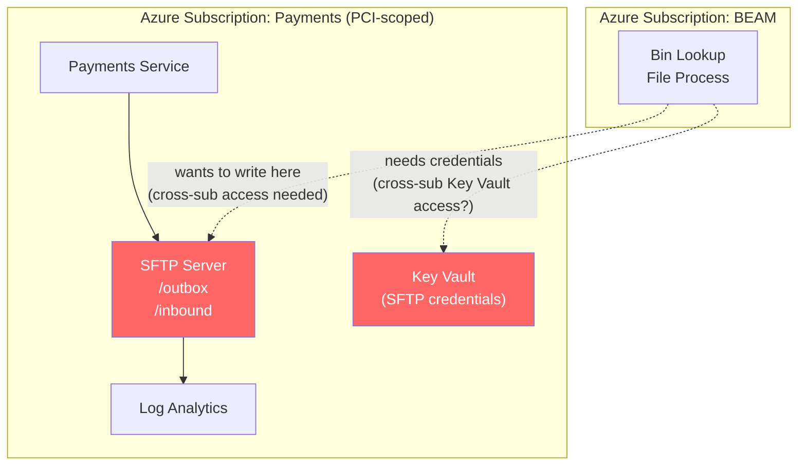
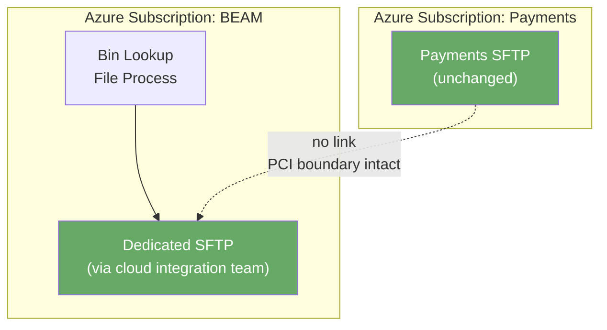

# SFTP Bin Lookup File Transfer — Cross-Subscription Analysis

**Date:** 2026-05-21  
**Status:** Under review — DA/InfoSec submission pending

---

## Context

Proposal to reuse an existing Payments SFTP server for bin lookup file transfer
from a separate team operating in a **different Azure subscription**.

---

## Security Risks

| Risk | Level | Detail |
|---|---|---|
| PCI scope bleed | 🔴 High | If Payments SFTP is PCI-scoped, cross-subscription access from a non-PCI subscription is likely an audit finding |
| Cross-domain data leakage | 🟡 Medium | Folder ACL misconfiguration could expose Payments data |
| Single point of failure | 🟡 Medium | Both domains impacted if shared SFTP fails |
| Credential / Key Vault sharing | 🟡 Medium | SFTP keys accessible across subscriptions increases attack surface |
| Audit trail fragmentation | 🟡 Medium | Logs in Payments' Log Analytics — invisible to the other team's security function |
| Operational ownership confusion | 🟡 Medium | Formal RACI required before go-live |

---

## Cross-Subscription Architecture Problem

**Problems introduced:**
- VNet peering or Private Endpoint required across subscription boundaries
- Managed Identity / service principal trust must span subscriptions
- Both subscriptions' security postures become tightly coupled
- BEAM's processes pulled into PCI scope if Payments SFTP is PCI-scoped

---

## Recommended Architecture

**Benefits:**
- PCI boundary remains intact
- Each subscription has its own credentials, logs, and on-call ownership
- No cross-subscription IAM complexity
- Payments shares technical documentation on the SFTP pattern — not the infrastructure

---

## When SFTP Reuse Could Be Acceptable

Only if **all** of the following are confirmed:
- Bin lookup files contain no cardholder data
- Payments SFTP is confirmed out of PCI scope
- Strict folder isolation with separate service accounts and no cross-read permissions
- Full per-domain audit logging in place

---

## Recommendation

> Separate SFTP (provisioned via the cloud integration team) is the cleaner, safer, and more auditable path. The existing Payments SFTP technical documentation can be shared as a reference pattern without sharing the infrastructure itself.

InfoSec and Design Authority review required before any decision is finalised.
